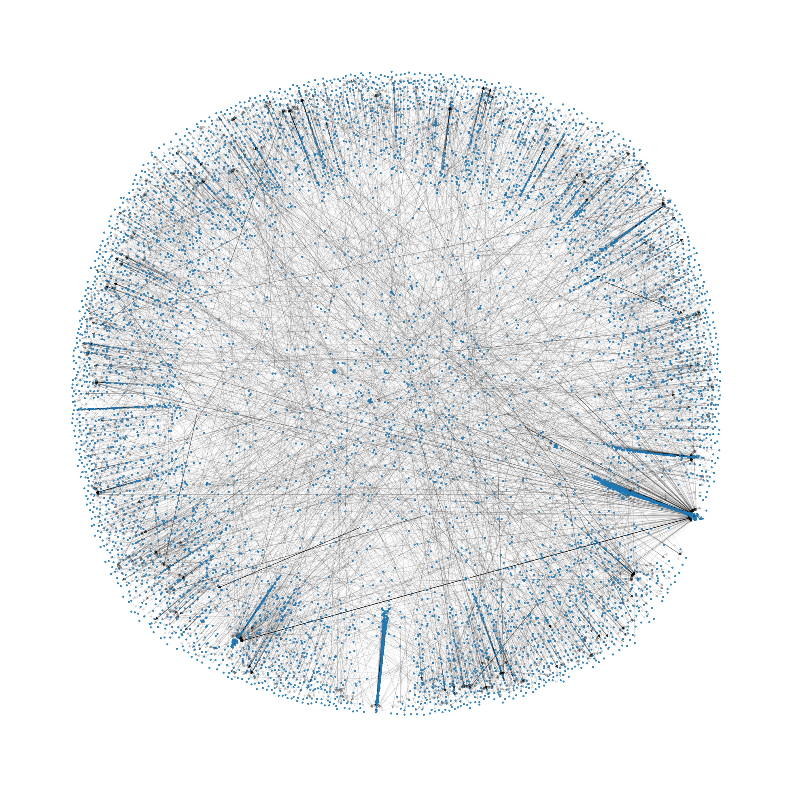
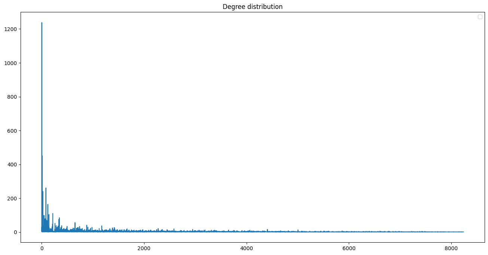
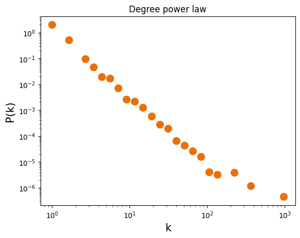

---
author:
- Joé Vincent-Galtié
bibliography:
- sample.bib
title: Politique et réseaux sociaux ou comment Twitter est-il devenu le
  terrain de jeu des "ingénieurs du chaos" ?
---

# Introduction

Les réseaux sociaux sont devenus des outils majeurs pour la
communication et l’expression des opinions à travers le monde. En
particulier, Twitter est devenu un lieu majeur de discussion pour les
sujets d’actualité et de politique. Cependant, il est largement observé
que ces discussions peuvent être fragmentées en communautés qui
s’auto-organisent autour d’idées et d’opinions similaires. Pour les
membres de ces communautés, l’exposition aux idées contraires et à la
nuance est considérablement réduite au profit d’idées similaires ou
d’idées contraires polarisantes.

La polarisation sur les réseaux sociaux et celle de la politique
s’auto-alimentent, avec un effacement progressif de la résonnance des
discours socio-démocrates. L’obejctif de ce papier est d’identifier,
grâce aux outils de science des réseaux, ces communautés. Celles-ci
peuvent être considérées comme des chambres d’échos popularisées ,
utilisées notamment par les ingénieur du chaos, selon l’expression de
Giuliano Da Empoli, ces "spin doctors" des partis populistes qui
oeuvrent à la diffusion d’informations éronées destinées à susciter des
sentiments négatifs, pillier du vote populiste. Bien qu’assumées parfois
ouvertement fausses par les candidats eux-mêmes, et souvent délirantes,
ces informations diffusées au sein de communautés suffisamment isolées
et endogènes ne suscitent guère d’opposition et nourissent ainsi des
dynamiques "anti-establishment" particulièrement efficaces.

Le présent rapport présente une démarche d’objectivation de ce phénomène
[^1]. Il s’inspire du travail réalisé par plusieurs équipes de
recherche, notamment celles du CNRS avec le politoscope.

# Nos Datasets

Les données issues de Twitter ont jusqu’ici offert des opportunités de
recherche très intéressantes. L’idéal aurait été de pouvoir constituer
un dataset à partir d’extraction de données relatives à des hashtags
spécifiés. Les récents changements de politiques relatives à
l’utilisation de l’API de Twitter ont néanmoins mis fin aux extractions
gratuites. Faute de temps, et donc également de budget, nous avons
choisi deux datasets en accès libre.

## Harvard DataVerse US Elections 2016

l0.25

Le premier dataset intutilé ["2016 United States Elections Tweets
IDS"](https://dataverse.harvard.edu/dataset.xhtml?persistentId=doi:10.7910/DVN/)
est issu du harvard dataverse et est composé de plusieurs millions de
tweets traitant des élections présidentielles américaines de 2016.

### Traitement

Nous avons travaillé sur un dataset issu du retraitement des données
susmentionnées.

Les operations effectuées ont été les suivantes :

-   concaténation des données

-   suppression des données aberrantes

-   suppression des interactions hors retweets

-   suppression des auto-retweets

## Harvard DataVerse Elysée2017fr

Le second dataset est également issu du Harvard Dataverse. Il a été
constitué par Ophélie Fraisier et al. .

Ce dataset est particulièrement intéressant par sa qualité. Il est en
effet un dataset annoté de comptes twitter actifs durant la campagne
frnaçaise de 2017.

Les principales caractéristiques de cet ensemble de données sont les
suivantes :

-   22 853 profils Twitter actifs sur un événement politique français
    majeur, annotés manuellement par des experts.

-   6 opinions politiques (5 partis et une catégorie non définie).

-   Des affiliations à des partis politiques qui se chevauchent.

-   Données supplémentaires concernant la nature des profils et le sexe
    des propriétaires lorsqu’elles sont disponibles.

-   Ids pour 2 414 584 tweets et 7 763 931 retweets dis- cussant cette
    élection en plusieurs langues.

-   Réseaux de retweets et de mentions.

# Une détection des communautés par l’algorithme de Louvain

L’algorithme de détection de communautés de Louvain est une méthode
heuristique simple basée sur l’optimisation de la modularité utilisée
pour extraire la structure communautaire d’un réseau. L’algorithme
fonctionne en deux phases. Dans la première phase, chaque nœud est
assigné à sa propre communauté, puis pour chaque nœud, l’algorithme
essaie de trouver le gain de modularité maximal en déplaçant le nœud
vers toutes les communautés voisines. Si aucun gain positif n’est
obtenu, le nœud reste dans sa communauté d’origine. Le gain de
modularité est calculé sur la base de la somme des poids des liens et du
paramètre de résolution. Dans la deuxième phase, un nouveau réseau est
construit avec les nœuds correspondant aux communautés trouvées dans la
première phase, et les poids des liens entre les nouveaux nœuds sont
donnés par la somme des poids des liens entre les nœuds des deux
communautés correspondantes. Les deux phases sont exécutées jusqu’à ce
qu’aucun gain de modularité ne soit obtenu ou que le seuil soit atteint.

La formule pour calculer le gain de modularité en déplaçant un nœud
isolé *i* dans une communauté *C* est donnée par :

$\\Delta Q = \\frac{k\_{i,\\mathrm{in}}}{2m} - \\gamma \\frac{\\Sigma\_{\\mathrm{tot}} \\cdot k_i}{2m^2}$

où *m* est la taille du graphe, *k**i*, in est la somme des
poids des liens du nœud *i* vers les nœuds de *C*, *k**i* est
la somme des poids des liens incidents au nœud *i*, *Σ*tot
est la somme des poids des liens incidents aux nœuds de *C*, et *γ* est
le paramètre de résolution.

# US Elections 2016

## Description du réseau

| Nombre de nœuds |          8239          |
|:----------------|:----------------------:|
| Nombre d’arêtes |         11115          |
| Densité         | 1.6 \* 10−4 |
| Réciprocité     | 3.5 \* 10−4 |

Informations sur le réseau

Dans les réseaux de ce type, où nous avons des profils populaires comme
Hilary Clinton et Donald Trump, ces profils agissent généralement comme
les plus grands hubs et ont donc des degrés très élevés, tandis que le
reste des profils ont des degrés significativement plus faibles (ont été
retweetés une fois, ou pas du tout). Ce phénomène peut s’observer dans
la Figure
<a href="#fig:image1" data-reference-type="ref" data-reference="fig:image1">[fig:image1]</a>.
Sans surprise, le réseau étudié possède une distribution de degrée
suivant une loi de puissance approximée par
$\\mathbb{P(k)} = \\frac{1}{k^{3}}$

<figure>
<figcaption aria-hidden="true">Graphique représentant la power law des degrés du graphe</figcaption>
</figure>

<figure>
<figcaption aria-hidden="true">Graphique représentant la power law des degrés du graphe</figcaption>
</figure>

## Centralité des noeuds

\[tab:degree_centrality\]

| Compte Twitter  | Degré | Opinion politique |
|:----------------|:-----:|:-----------------:|
| realDonaldTrump | 0.150 |     pro-Trump     |
| Zeddary         | 0.055 |      neutre       |
| wikileaks       | 0.032 |     pro-Trump     |
| FoxNews         | 0.029 |       média       |
| HillaryClinton  | 0.020 |    pro-Clinton    |
| thehill         | 0.013 |    pro-Clinton    |
| LindaSuhler     | 0.013 |     pro-Trump     |
| MULawPoll       | 0.012 |      Centre       |
| TheDailyShow    | 0.010 |       media       |
| CNN             | 0.010 |       média       |

Les 10 comptes avec les plus hautes centralités de proximité

| Compte Twitter  | Degré | Nuance politique |
|:----------------|:-----:|:----------------:|
| realDonaldTrump | 0.100 |    Pro-Trump     |
| Zeddary         | 0.043 |      Neutre      |
| wikileaks       | 0.025 |      Neutre      |
| FoxNews         | 0.023 |    Pro-Trump     |
| HillaryClinton  | 0.016 |   Pro-Clinton    |
| thehill         | 0.009 |      Neutre      |
| LindaSuhler     | 0.010 |    Pro-Trump     |
| MULawPoll       | 0.007 |      Neutre      |
| TheDailyShow    | 0.008 |   Pro-Clinton    |
| CNN             | 0.007 |   Pro-Clinton    |

Les 10 comptes avec les plus hautes centralités de proximité

Les résultats (cf.table 2 et 3) montrent que les comptes très politisés,
en particulier ceux qui soutiennent Donald Trump, ont une centralité de
degré élevée, ce qui signifie qu’ils ont de nombreux liens directs avec
d’autres comptes Twitter. Cela leur permet de diffuser rapidement
l’information qu’ils publient à un large public, amplifiant ainsi leur
portée et leur influence sur la plateforme.

Les comptes neutres et les médias traditionnels, en revanche, ont des
centralités de degré relativement plus faibles. Cela peut s’expliquer
par le fait que ces comptes ne sont pas aussi engagés politiquement que
les autres, et qu’ils ont tendance à publier des informations plus
généralistes, ce qui peut limiter leur impact sur la plateforme.

En résumé, les résultats de cette analyse montrent que les comptes
Twitter les plus politisés, en particulier ceux qui soutiennent Donald
Trump, ont une centralité de degré importante, ce qui leur permet de
diffuser rapidement l’information à un large public. Cela souligne
l’importance de l’engagement politique sur les réseaux sociaux et
l’impact que cela peut avoir sur la diffusion de l’information en ligne.

## Communautés

L’analyse des communautés a été effectuée grâce à l’algorithme de
Louvain. Le graphe contient 24 communautés contenant plus de 100 noeuds.
La Figure
<a href="#fig:graph_commu" data-reference-type="ref" data-reference="fig:graph_commu">3</a>
représente le graphe induit des différentes communautés, les noeuds
correspondent au noeud central de chaque communauté. Sans surprise,
parmi les centres des 24 communautés identifiées, figurent des comptes
populaires marqués politiquement tels que FoxNews, Donald Trump
(realDonaldTrump), Hillary Clinton, Wikileaks, Wayne Dupree (créateur de
contenus à destination des électeurs de droite et d’extrême droite),
Linda SUhler, compte fan de Donald Trump ... Les comptes identifiés sont
en tout état de cause majoritairement pro-Trump, promoteurs de contenus
thuriféraires du courant MAGA (Make America Great Again) et détracteurs
de la "woke culture".

<figure>
<figcaption aria-hidden="true">Graphe induit des communautés de plus de 100 noeuds</figcaption>
</figure>

# Elysée2017fr

| Nombre de nœuds |         22048          |
|:----------------|:----------------------:|
| Nombre d’arêtes |        1321948         |
| Densité         | 2.7 \* 10−3 |
| Réciprocité     | 8.9 \* 10−2 |

Informations sur le réseau

La même démarche d’analyse a été effectuée avec le jeu de données
"Elysée2017fr" (cf code). Le travail d’identification des opinions
politiques de l’ensemble des comptes du jeu de données par les auteurs
de ce jeu nous ont permis d’introduire un niveau supplémentaire
d’analyse : le degré d’endogénéïté et d’adversité des communautés.  
Le degré d’endogénéïté est ainsi défini, pour une communauté donnée, par
la part de comptes rattachés au même parti que le compte au centre de la
commaunuté, tandis que le degré d’adversité est la part des comptes
rattachés à un parti adverse à celui du compte centre. La qualification
de parti adverse a été effectuée au regard des affrontements politiques
récents. Sont ainsi qualifiés d’avserses deux partis aux postionnements
antagonistes. Pour la France Insoumise, les partis adverses sont alors
Renaissance, Les Républicains et le FN.

| Parti du centre | Indice d’endogénéité | Indice d’adversité |
|:---------------:|:--------------------:|:------------------:|
|       em        |        0.620         |       0.138        |
|       lr        |        0.710         |       0.057        |
|       ps        |        0.794         |       0.007        |
|       fn        |        0.812         |       0.041        |
|       fi        |        0.792         |       0.029        |

Tableau des indices d’endogénéité et d’adversité pour les différents
partis politiques

Ce tableau résumant les résultats tend à indiquer, à l’exception du
Parti Socialiste, que les partis avec la plus forte endogénéïté et ainsi
la plus faible adversité sont les partis extrêmes.

## Conclusion

Ainsi, les données américaines comme les données françaises confirment
la formation de communautés politiques sur les réseaux sociaux. La
qualité des données françaises nous permet également d’observer une plus
forte endogénéïté des comptes au sein des communautés de partis
extrêmes.

Ce travail entend soutenir la prise en compte de ces phénomènes dans
l’analyse des dynamiques électorales et informationnelles. De telles
communautés endogènes offrent en particulier des bulles de résistance
aux fausses informations inateignables pour le simple "fact-checking".

Pour aller plus loin, un plus grand travail de récolte des données
aurait notamment pu être effectué et un suivi temporel aurait permis de
mettre en perspectives ces dynamiques.

[^1]: <https://github.com/joevincentgaltie>
